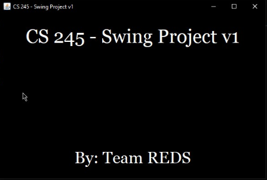
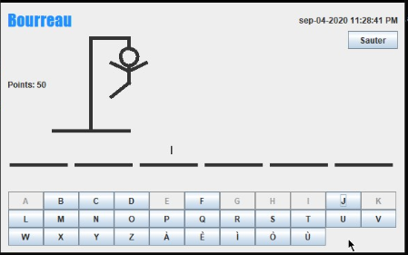

# Lab04

- En este laboratorio empezamos clonando el proyecto Hangman y a partir de este \
se deben implementar los métodos calculateScore de las variantes de gameScore.\
debemos hacer commit de la especificación de los métodos. Se actualiza el pom para \
incluir la última versión de jUnit y versión del compilador de java version 8. \
Posteriormente se implementa las pruebas de GameScoreTest, para cada clase de \
equivalencia  y condición de frontera implementando una prueba para cada una \
y hacemos el commit de la implementación pruebas. Se implementa los cascarones \
que ya habíamos realizado y se verifica que se ejecute satisfactoriamente para \
hacer el commit de la implementacion del modelo y finalmente para terminar la \
parte 1 hacemos un git push del repositorio.

Para la parte 2 se va a utilizar el hangmanFactoryMethod incluyendo el originalScore \
a la configuración, modificamos la inyección de dependencias utilizando guice en lugar \ 
del método fábrica.Se configura la aplicación a través de GUICE, así mismo como las \
otras dependencias. Modificamos algunos comportamientos de la inyección de \
dependencias. El resultado se muestra a continuación.

 
 